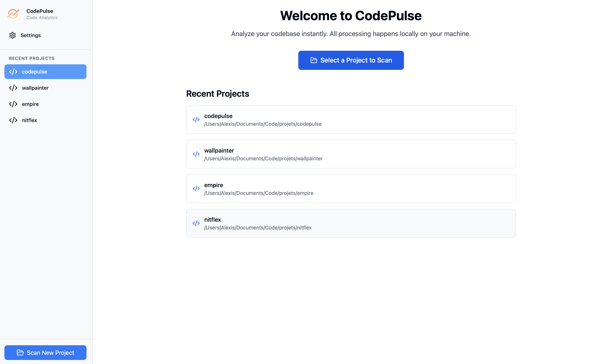
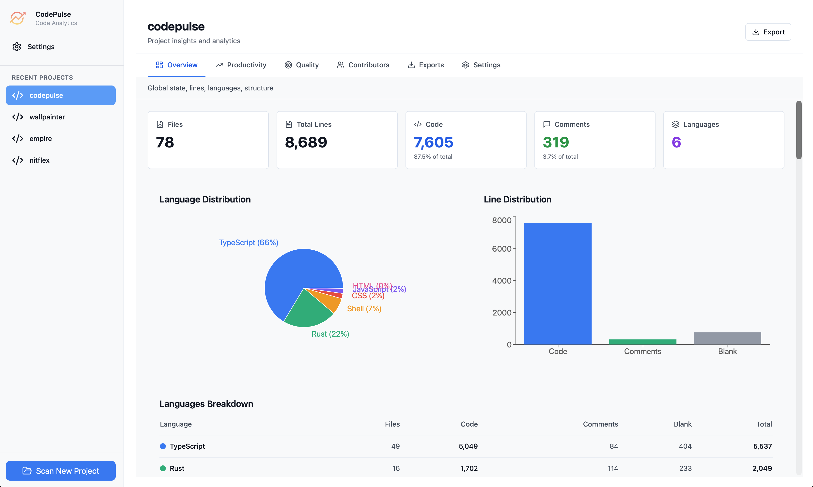
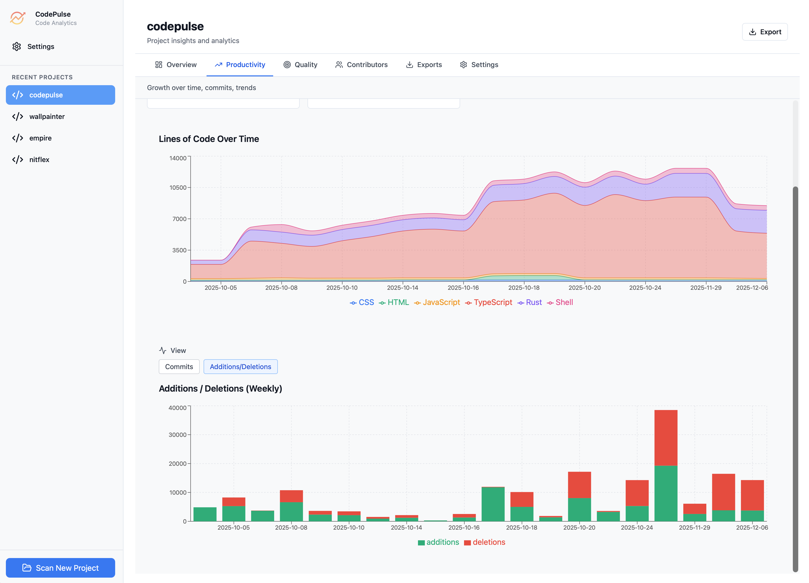

# CodePulse

CodePulse is a cross-platform desktop application that analyzes your codebase and provides detailed statistics, visualizations, and insights — all while keeping your code completely private and offline.

# ✨ Features

- 🚀 **Lightning Fast**: Rust-powered backend scans thousands of files in seconds
- 🔒 **Privacy First**: All analysis happens locally—your code never leaves your machine
- 📊 **Rich Insights**: Detailed stats, interactive charts, and breakdowns by language
- 💾 **Export**: Save results as CSV, JSON, HTML or even Markdown!
- 🌍 **Cross-Platform**: Works on macOS, Windows, and Linux

# 🚀 Quick Start

You can run the following commands to easily run the application on your computer :

```bash
# Clone and setup
git clone https://github.com/AdlarX9/codepulse.git
cd code-pulse
./codepulse.sh setup

# Launch desktop app
./codepulse.sh desktop

# Or launch web app
./codepulse.sh web
```

# Examples

> 
> Home page

> 
> Your project overview

> 
> A project's evolution scanned from its git repo
