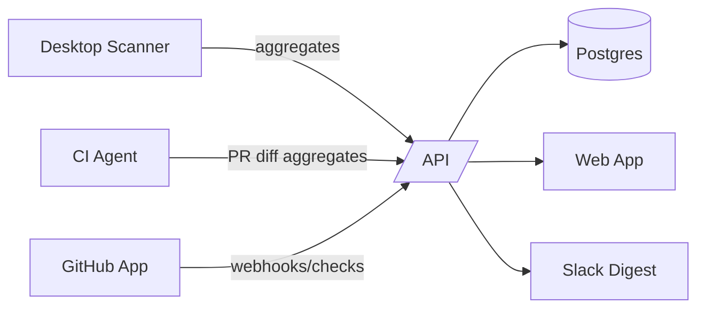

# Contexte et architecture actuelle

- **[Architecture]**
    - **API** Go Gin (`apps/api/`), modèles GORM (`apps/api/internal/models/`), handlers (`apps/api/internal/handlers/`), middleware (`apps/api/internal/middleware/`).
    - **Desktop** Tauri + Rust + React (`apps/desktop/`), scanner local, queue de sync ([src-tauri/src/sync.rs](cci:7://file:///Users/Alexis/Documents/Code/projets/code-pulse/apps/desktop/src-tauri/src/sync.rs:0:0-0:0)), commandes Tauri.
    - **Web** Next/React (`apps/web/`) pour le front SaaS.
- **[Flux existants]**
    - `POST /api/sync/scan` pour synchroniser des scans locaux (agrégés).
    - `GET/POST/PATCH/DELETE /api/me/projects` + `GET /api/me/projects/:id/details` + `POST /api/me/projects/:id/snapshot`.
    - Desktop scanne localement, ne remonte que des agrégats (pas de code), puis snapshot vers API.



## Vision et positionnement

- **[Problème]** Mesurer et piloter la “connaissance” et la maintenabilité (doc/comments/bloat) à l’échelle; mettre des garde-fous PR; éviter d’exfiltrer le code.
- **[Cibles]** Scale-ups/PME (10–200 devs), agences/ESN, OSS/indies.
- **[Différenciation]** Privacy-by-design (pas de code en clair), indicateurs “doc & maintainability”, time-to-value rapide (GitHub App, Slack digest, PR checks).
- **[Offre]**
    - Dashboards d’équipe/org (trends, hotspots doc/bloat/core vs info).
    - PR guardrails (budgets doc/qualité).
    - Weekly digest (Slack/Email).
    - Add-on AI Docs (suggestions doc/PR local/CI sans fuite code).
    - Packaging Free/Pro/Team/Enterprise (+ add-on AI).

# Mission

Tu es le Lead Dev de CodePulse. Implémente les fonctionnalités ci-dessous, en gardant les principes:

- Privacy-first: ne jamais stocker de source. Synchroniser uniquement des agrégats.
- Multi-tenant: orgs, rôles, quotas par plan.
- Observabilité, sécurité, résilience.
- Cohérence de schémas JSON snake_case.

Exécute les tâches par section. Crée les fichiers/dossiers indiqués, adapte les existants. Documente k/v dans `.env.example`.

## 1) Modèle d’organisation, membres et rôles

- **[But]** Multi-tenant complet pour plans et politiques.
- **[Modèles]** dans `apps/api/internal/models/`:
    - `Organization { id uuid pk, name, slug unique, created_at, updated_at }`
    - `Membership { id, org_id fk, user_id fk, role enum['owner','admin','member'], created_at }`
    - `Subscription { id, org_id fk, plan enum['free','pro','team','enterprise'], seats int, status, current_period_end, created_at, updated_at, stripe_customer_id?, stripe_subscription_id? }`
    - Indexes: `(org_id,user_id)` unique; `(slug)` unique.
- **[Handlers]** `apps/api/internal/handlers/org.go`:
    - `POST /api/orgs` (create), `GET /api/orgs/me` (list user’s orgs), `POST /api/orgs/:id/invite`, `GET /api/orgs/:id/members`, `PATCH /api/orgs/:id/members/:user_id` (role), `DELETE /api/orgs/:id/members/:user_id`.
- **[Middleware]** `apps/api/internal/middleware/org_context.go`: résout `org_id` depuis header `X-Codepulse-Org` ou user default; vérifie permissions.
- **[DB]** Migrations SQL sous `apps/api/migrations/`. AutoMigrate toléré en dev seulement.

## 2) GitHub App et webhooks, checks PR

- **[But]** Intégrer GitHub pour PR checks, installations, repo linking.
- **[Service]** `apps/api/internal/github/`:
    - Client OAuth App/Checks API, vérif signature webhook (HMAC).
    - Fonctions: `HandleInstallation`, `HandlePullRequest`, `HandleCheckSuite`, `CreateOrUpdateCheckRun`.
- **[Handlers]** `apps/api/internal/handlers/github.go`:
    - `POST /api/github/webhook` (public, HMAC verify).
    - `GET /api/github/install/callback` (échange tokens si nécessaire).
- **[Modèles]**
    - Étendre `GitHubLink { installation_id, repo_full_name, repo_data jsonb }` déjà existant.
    - `Repository { id, org_id fk, provider='github', external_id, full_name, visibility, default_branch, created_at }` si besoin.
- **[Checks PR]**
    - À la réception d’un PR event, associer le repo au [Project](cci:2://file:///Users/Alexis/Documents/Code/projets/code-pulse/apps/desktop/src/components/ProjectDetails.tsx:22:0-43:1)/`Repository`.
    - Recevoir snapshots CI (voir §4) → calculer budgets → `CreateOrUpdateCheckRun` (conclusion success/failure, summary avec ratios/budgets).
- **[Env]** `GITHUB_APP_ID`, `GITHUB_PRIVATE_KEY`, `GITHUB_WEBHOOK_SECRET`.

## 3) Budgets qualité et policies

- **[But]** Garde-fous PR, objectifs d’équipe.
- **[Modèles]** `QualityBudget { id, org_id, scope enum['org','repo','project'], ref_id, thresholds jsonb, mode enum['soft','hard'], created_at, updated_at }`
    - `thresholds` ex: `{ "comment_ratio_min": 0.15, "bloat_max": 0.25, "doc_coverage_min": 0.6 }`
- **[Handlers]** `apps/api/internal/handlers/policy.go`:
    - `GET/POST/PATCH/DELETE /api/orgs/:org_id/policies`
- **[Évaluation]** Service `internal/quality/evaluator.go`:
    - Prend un snapshot (diff ou full) + policy → renvoie verdict + messages.
- **[Couplage PR]** Appelé par GitHub webhook lorsque snapshot PR est reçu.

## 4) CI Agent (scan côté CI) + endpoint snapshots PR

- **[But]** Scanner diffs en CI sans fuite de code.
- **[Rust CLI]** Créer `ci-agent/` (crate Rust) réutilisant la lib scanner (extraire la logique commune depuis `apps/desktop/src-tauri/src/scanner.rs` en `scanner_lib/`).
    - Entrées: base_path, head_sha, base_sha, include/exclude, output JSON agrégé (mêmes structures que Desktop: totals/per_language/files minimalistes pour diff).
    - Distribué via Docker image.
- **[API]** `apps/api/internal/handlers/ci.go`:
    - `POST /api/ci/snapshots` (auth par token org/repo), payload:

```json
{
	"org_id": "...",
	"repository": "owner/name",
	"commit_sha": "...",
	"pull_request": 123,
	"totals": {
		"total": 1234,
		"code": 890,
		"comment": 210,
		"blank": 134,
		"core_code_lines": 500,
		"info_lines": 624
	},
	"per_language": [
		{ "language": "ts", "files": 10, "total": 100, "code": 60, "comment": 30, "blank": 10 }
	],
	"scanned_at": "<unix_ts>"
}
```

- Stocke [Scan](cci:2://file:///Users/Alexis/Documents/Code/projets/code-pulse/apps/api/internal/models/models.go:59:0-79:1) et [ScanLang](cci:2://file:///Users/Alexis/Documents/Code/projets/code-pulse/apps/api/internal/models/models.go:82:0-93:1) liés au repo/PR/commit. Déclenche évaluation `QualityBudget` et crée un check GitHub.

## 5) Dashboards Web et analytics d’équipe

- **[But]** Donner la vue org/repo/projet, trends, hotspots.
- **[Web]** `apps/web/src/`:
    - Pages: `dashboard/`, `projects/`, `repos/`, `policies/`, `org/settings/`, `billing/`.
    - Composants: charts (trends 7/30/90j), KPI (comment_ratio, doc_coverage, core vs info, bloat), leaderboard projets.
- **[API]** `apps/api/internal/handlers/stats.go`:
    - `GET /api/orgs/:id/stats?window=30d` (agrégations).
    - `GET /api/repos/:id/stats`, `GET /api/projects/:id/stats`.
- **[Benchmarks]** Endpoint public anonyme pour moyennes par langage/équipe (opt-in).

## 6) Slack/Email weekly digest

- **[But]** Créer l’habitude, alerter sur écarts.
- **[Worker]** `apps/api/internal/worker/digest.go`:
    - Planifie hebdomadaire (cron ou goroutine) → agrège stats → Slack + Email.
- **[Slack]** `apps/api/internal/slack/`:
    - OAuth, stockage tokens par org, envoi message formaté.
- **[Email]** Provider (Postmark/SES), templates.
- **[Handlers]** `POST /api/orgs/:id/integrations/slack/connect`, `DELETE /.../disconnect`.

## 7) Billing Stripe (plans, sièges, quotas)

- **[But]** Monétiser par siège, auto-provisioning.
- **[Handlers]** `apps/api/internal/handlers/billing.go`:
    - `POST /api/billing/checkout` (création session), `POST /api/billing/portal`.
    - `POST /api/billing/webhook` (Stripe events: customer.subscription.\*).
- **[Subscription logic]**
    - Mise à jour `Subscription` selon webhook.
    - Quotas: projets, historisation (90 jours Free, 365 Team), Slack/PR checks, politiques actives.
- **[Env]** `STRIPE_SECRET_KEY`, `STRIPE_WEBHOOK_SECRET`, `STRIPE_PRICE_*`.

## 8) Sécurité et confidentialité

- **[Données]** Aucun code source; agrégats uniquement.
- **[Auth]** JWT/Bearer; SSO/SAML plus tard (préparer structure).
- **[Scopes]** Permissions par rôle (owner/admin/member). Middleware org.
- **[Stockage secrets]** Chiffrés (Stripe, Slack, GitHub).
- **[Logs/Audit]** Journaliser accès sensibles, exports.

## 9) Observabilité produit

- **[Metrics]** Activation (GitHub App connectée, policy créée), utilisation (dashboards, checks PR), rétention, conversion plan.
- **[Eventing]** `apps/api/internal/metrics/events.go` (post vers analytics interne/Segment).
- **[Flags]** Feature flags simples par plan/org.

## 10) Desktop enhancements (UX & robustesse)

- **[Bind folder UX]** [apps/desktop/src/components/ProjectDetails.tsx](cci:7://file:///Users/Alexis/Documents/Code/projets/code-pulse/apps/desktop/src/components/ProjectDetails.tsx:0:0-0:0): bouton “Bind folder” si aucun chemin lié; commandes Tauri [get_project_binding](cci:1://file:///Users/Alexis/Documents/Code/projets/code-pulse/apps/desktop/src-tauri/src/main.rs:99:0-102:1), [set_project_binding](cci:1://file:///Users/Alexis/Documents/Code/projets/code-pulse/apps/desktop/src-tauri/src/main.rs:104:0-107:1).
- **[Project overrides]** Merge stable des overrides `project.settings` avec [UserSettings](cci:2://file:///Users/Alexis/Documents/Code/projets/code-pulse/apps/desktop/src/types.ts:39:0-52:1) avant scan (déjà amorcé).
- **[Queue]** Robustifier [src-tauri/src/sync.rs](cci:7://file:///Users/Alexis/Documents/Code/projets/code-pulse/apps/desktop/src-tauri/src/sync.rs:0:0-0:0) (retries/backoff, logs).
- **[Compute key hash]** Déjà exposé; s’assurer de cohérence `project_key_hash` (base_path + local_salt).
- **[CI parity]** Factoriser la lib scanner commune en crate `scanner_lib/` (réutilisée par Desktop et CI agent).

## 11) Schéma de données (ajouts majeurs)

- **[Tables]**
    - `organizations`, `memberships`, `subscriptions`
    - `repositories` (optionnel si séparation de `projects`)
    - `quality_budgets` (policies)
    - `integrations` (provider, tokens chiffrés)
    - `audit_logs` (who/when/what)
- **[Indexation]** sur `(org_id)`, `(project_id, created_at)`, `(repo_id, commit_sha)`, `(installation_id)`.
- **[Retention]** requêtes filtrées par plan (ex: `created_at >= now() - interval '90 days'`).

## 12) API: endpoints et schémas (résumé)

- **[Org]** `/api/orgs` (CRUD, invites, members).
- **[Stats]** `/api/orgs/:id/stats`, `/api/repos/:id/stats`, `/api/projects/:id/stats`.
- **[Policies]** `/api/orgs/:id/policies` (CRUD).
- **[CI]** `/api/ci/snapshots` (POST).
- **[GitHub]** `/api/github/webhook` (POST), `/api/github/install/callback` (GET).
- **[Billing]** `/api/billing/checkout|portal` (POST), `/api/billing/webhook` (POST).
- **[Slack]** `/api/orgs/:id/integrations/slack/connect|disconnect`.

## 13) Config et secrets (.env)

- **[API]** `PORT`, `ENVIRONMENT`, `DATABASE_URL`, `ALLOWED_ORIGINS`.
- **[GitHub]** `GITHUB_APP_ID`, `GITHUB_PRIVATE_KEY`, `GITHUB_WEBHOOK_SECRET`.
- **[Stripe]** `STRIPE_SECRET_KEY`, `STRIPE_WEBHOOK_SECRET`, `STRIPE_PRICE_*`.
- **[Slack]** `SLACK_CLIENT_ID`, `SLACK_CLIENT_SECRET`, `SLACK_SIGNING_SECRET`.
- **[Email]** `POSTMARK_TOKEN` ou `AWS_SES_*`.

## 14) Tests et validations

- **[E2E]** Scénarios: créer org → connecter GitHub App → importer projet → définir policy → ouvrir PR → voir check run + dashboard mis à jour → recevoir digest Slack.
- **[Unit]** Évaluateur de budgets, sign vérification webhooks, quotas par plan.
- **[Load]** Insertion scans en rafale (CI), agrégations rapides via indexes.

---

# Détails d’implémentation ciblés (pistes concrètes)

- **[API Go]**
    - Ajoute fichiers: `internal/handlers/{org.go,github.go,ci.go,policy.go,stats.go,billing.go}`, `internal/github/client.go`, `internal/quality/evaluator.go`, `internal/worker/digest.go`, `internal/slack/client.go`, `internal/metrics/events.go`, `internal/middleware/org_context.go`.
    - Étend [cmd/server/main.go](cci:7://file:///Users/Alexis/Documents/Code/projets/code-pulse/apps/api/cmd/server/main.go:0:0-0:0) pour router ces endpoints et middlewares (CORS, auth).
- **[Desktop Tauri]**
    - Ajoute crate `scanner_lib/` et refactor `src-tauri/src/scanner.rs` pour l’utiliser.
    - Commandes Tauri existantes: renforcer [get_project_binding](cci:1://file:///Users/Alexis/Documents/Code/projets/code-pulse/apps/desktop/src-tauri/src/main.rs:99:0-102:1), [set_project_binding](cci:1://file:///Users/Alexis/Documents/Code/projets/code-pulse/apps/desktop/src-tauri/src/main.rs:104:0-107:1), [compute_project_key_hash](cci:1://file:///Users/Alexis/Documents/Code/projets/code-pulse/apps/desktop/src-tauri/src/sync.rs:52:0-58:1).
    - UI: [ProjectDetails.tsx](cci:7://file:///Users/Alexis/Documents/Code/projets/code-pulse/apps/desktop/src/components/ProjectDetails.tsx:0:0-0:0) ajouter bouton “Bind folder”.
- **[CI Agent]**
    - Crée `ci-agent/` (Rust) avec CLI:

```bash
ci-agent --path /repo --base-sha $BASE --head-sha $HEAD --include '**/*' --exclude 'node_modules/**' --out /tmp/snapshot.json
```

- JSON conforme au payload `/api/ci/snapshots`.
- **[Web]**
    - Pages Next: `pages/dashboard.tsx`, `pages/policies.tsx`, `pages/billing.tsx`, `pages/org/settings.tsx`, `pages/repos/[id].tsx`, `pages/projects/[id].tsx`.
    - Composants charts avec trends et KPI.

---

# Critères de réussite

- **[Fonctionnel]** PR checks opérationnels avec budgets; dashboards org/repo/projet fournissent trends; digest Slack hebdo envoyé; billing Stripe provisionne les plans.
- **[Sécurité]** Aucun code source stocké; secrets chiffrés; webhooks signés; RBAC org.
- **[UX]** Onboarding fluide (GitHub App → import → budgets → Slack); Desktop et CI synchronisent des agrégats cohérents.
- **[Business]** Packaging Free/Pro/Team/Enterprise avec quotas appliqués; conversion self-serve possible.

---

## Résumé exécutable (à l’IA dev)

- **[Construis]** multi-tenancy, policies/budgets, GitHub App+webhooks+checks, CI agent (Rust), stats dashboards, digest Slack, Stripe billing.
- **[Respecte]** privacy-by-design (agrégats only), rôles/org, quotas par plan.
- **[Livre]** endpoints, migrations, services, UI Web, intégrations Slack/Stripe/GitHub, refactor scanner en lib commune.
- **[Teste]** E2E PR, quotas, webhooks signés, évaluation budgets.
- **[Documente]** `.env.example`, README sections d’intégration, limites par plan.
